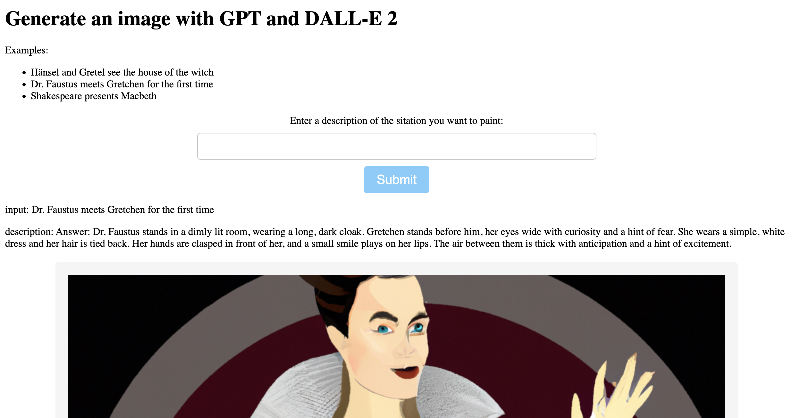

# ai-text2image

Example-App that shows the integration of [GPT3.5](https://platform.openai.com/docs/models/gpt-3) and [DALL-E 2](https://openai.com/product/dall-e-2) using [langchain](https://docs.langchain.com/docs/).

You need an OpenAI-API-key in order to run this example.

1. Describe a situation in natural language.
2. Create a scence description using GPT3.5
3. Create an image using the description using DALL-E 2.



The application is written in [Python](https://www.python.org/) using [Flask](https://flask.palletsprojects.com/en/2.2.x/). It uses [langchain](https://python.langchain.com/en/latest/index.html) and the [OpenAI API](https://openai.com/blog/openai-api).

## Installation

```shell
$ make init
$ source .venv/ai/bin/activate
```

## Running 

You need an OpenAI-API-key in order to run this example.

```shell
$ export OPENAI_API_KEY=<CREATE-A-KEY-AND-INSERT-HERE>
$ make run
```

Open the webbrowser at http://127.0.0.1:5000.

(c) 2023 Jörn Dinkla
