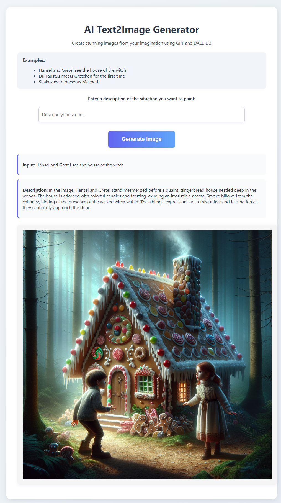

# ai-text2image

This app shows the integration of [GPT3.5 turbo](https://platform.openai.com/docs/models/gpt-3) and [DALL-E 3](https://openai.com/product/dall-e-3) using [langchain](https://docs.langchain.com/docs/).

You need an OpenAI-API-key in order to run this example.

1. Describe a situation in natural language.
2. Create a scence description using GPT3.5 turbo
3. Create an image using the description using DALL-E 3.



The application is written in [Python](https://www.python.org/) using [Flask](https://flask.palletsprojects.com/en/2.2.x/). It uses [langchain](https://python.langchain.com/en/latest/index.html) and the [OpenAI API](https://openai.com/blog/openai-api).

## Running 

You need an OpenAI-API-key, [uv](https://github.com/astral-sh/uv) and [just](https://just.systems/man/en/) to run this example.

```shell
$ export OPENAI_API_KEY="<CREATE-A-KEY-AND-INSERT-HERE>"
$ just run
```

Open the webbrowser at http://127.0.0.1:5000.

(c) 2023 - 2025 Jörn Dinkla
